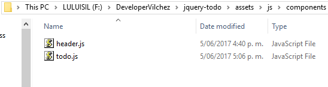
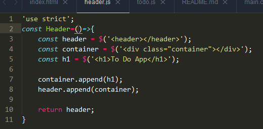
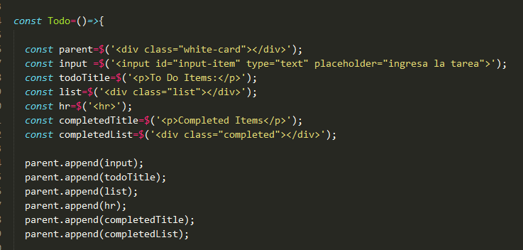
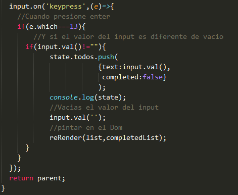
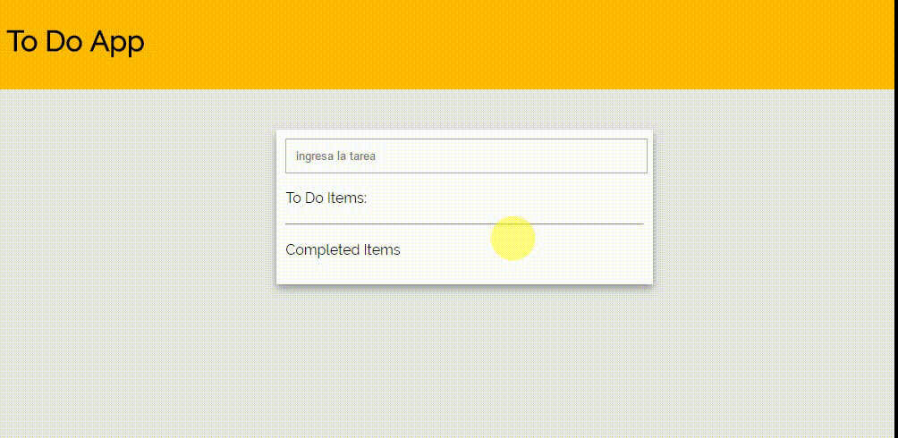

#To do React Style

## Objetivos
El presente trabajo tiene como objetivo
- Uilizar un patrón de diseño similar a React.
- Mostrar comprensión enn el uso de eventos y selectores básicos de jQuery
- Programación Funcional
- Layout por componentes

## Funcionalidad

###Componentes
Se trabajara con dos componentes (Header y Todo) los cuales se pintaran en el Dom una vez creados a través de un proceso de reRender 

### Creacion de componente Header
Luego de realizar el layout en el html se crea el componente Header en donde se mostrará el titulo. Todo a trvés de jQuery 

### Creación del componente todo
Este componente permite la creación de los items a través de un input, el cual al recibir el evento de teclado enter pintará en To Do Items y si se selecciona el item pasará al Competed Items 	

## Como se ve al final

## Desarrollado con:

`HTML` `Jquery` `CSS`  'Componentes' 'Programacion Funcional'

##  Créditos
* [Lourdes Vilchez](https://github.com/lulublondet)

